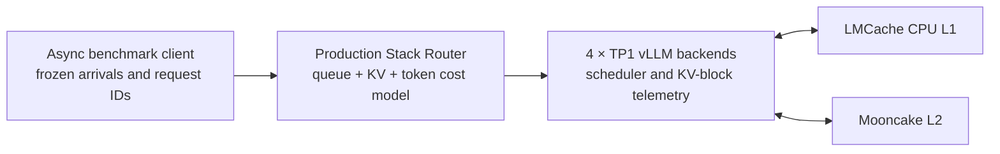

# Workload-aware KV Cache for Long-context Code Agents

English | [中文](README_ZH.md)

[](https://github.com/yangsiqt/workload-aware-kv-cache/actions/workflows/tests.yml)
[](LICENSE)

This project studies serving optimization for long-context, multi-turn code
agents. It combines cache locality with live queue and token-workload signals
instead of treating the highest prefix-cache hit rate as the only objective.

The evaluation uses Qwen3-30B-A3B-Instruct-2507 and SWE-bench Verified-derived
8K/16K/32K sessions on real NVIDIA H20 GPUs. It is a serving-systems benchmark:
it does not report SWE-bench solve rates and never places gold patches in model
prompts.

## Why this project

A multi-turn code-agent request can reuse a large repository prefix if it
returns to the same GPU. Strict affinity, however, can overload a hot backend.
With external KV storage, the router must also decide whether loading from CPU
L1 or Mooncake L2 is faster than local recomputation.

This project implements two completed optimization stages:

1. **Dual-H20 queue/locality-aware routing**: balance session KV locality
   against backend queueing.
2. **Four-H20 Adaptive KV V2.3**: choose a backend and one of Local HBM,
   LMCache CPU L1, Mooncake L2, or recomputation using live prefill/decode
   workload and observed execution costs.

## Architecture



The client, router decision/completion trace, scheduler lifecycle, and worker
execution events are joined by `request_id + attempt_id + backend_id`.
Workload, arrival trace, configuration, and component commits are frozen before
formal Before/After runs.

## Real 2×H20 results

The primary dual-GPU experiment used 50 SWE-bench-derived sessions, six turns
per session, 300 requests, and one fixed Poisson arrival trace. External KV and
PD were disabled; the comparison isolates routing over vLLM local prefix cache.

| Policy | TTFT p90 | E2E p90 | Throughput | Token hit | Session migration |
|---|---:|---:|---:|---:|---:|
| Official `prefixaware-512` | 3057.1 ms | 6960.2 ms | 1.799 req/s | 83.30% | 0.00% |
| `agent_slo_aware` | 1526.5 ms | 2182.5 ms | 1.861 req/s | 82.58% | 2.40% |
| Change | **-50.1%** | **-68.6%** | **+3.4%** | -0.72 pp | +2.40 pp |

In a separate 16K shared-prefix hotspot, `agent_slo_aware` reduced TTFT p90 by
25.8%, reduced E2E p90 by 21.1%, and improved throughput by 27.1%. The mechanism
is deliberate: a small, bounded loss of locality is acceptable when it removes
a much larger queue hotspot.

- [Main dual-H20 comparison](reports/dual-h20/main-r1-comparison.md)
- [16K hotspot comparison](reports/dual-h20/hotspot-16k-c16-comparison.md)

These are real-GPU, single-trace measurements and do not claim statistical
confidence intervals.

## Real 4×H20 Adaptive KV V2.3 results

The public result below is the pre-registered primary trace: 1200 requests,
4×H20 96GB, four TP1 backends, `max_num_seqs=12`, 8 GiB CPU L1 and 24 GiB
Mooncake L2 per backend, bursty 3.5/1.5 RPS arrivals averaging 2.5 RPS, and
client concurrency 64.

| Metric | fixed-4096 | Adaptive V2.3 | Change |
|---|---:|---:|---:|
| TTFT p50 | 1567.3 ms | 553.6 ms | **-64.7%** |
| TTFT p90 | 9631.9 ms | 5414.1 ms | **-43.8%** |
| TTFT p95 | 12420.8 ms | 8124.3 ms | **-34.6%** |
| TTFT p99 | 18617.3 ms | 12883.5 ms | **-30.8%** |
| E2E p50 | 3501.4 ms | 1908.4 ms | **-45.5%** |
| E2E p90 | 16543.8 ms | 13190.5 ms | **-20.3%** |
| E2E p95 | 19542.8 ms | 17434.5 ms | **-10.8%** |
| E2E p99 | 27826.5 ms | 21420.7 ms | **-23.0%** |
| Request throughput | 2.5014 req/s | 2.5013 req/s | -0.002% |
| SLO Goodput | 1.5008 req/s | 2.0302 req/s | **+35.3%** |
| SLO violation rate | 40.00% | 18.83% | **-21.17 pp** |

Adaptive V2.3 performed 409 policy overrides and 409 KV-path changes. Its main
mechanism in this trace was avoiding uncertain or expensive external recovery
in favor of verified HBM reuse or recomputation; this is not presented as an
increase in L1/L2 hit rate.

- [Primary-trace report](reports/four-h20/v2.3-primary-trace.md)

Scope: `PRIMARY_TRACE_REAL_4XH20_COHORT30_HOTSET`. These public numbers are a
single pre-registered trace and are not a cross-trace stability claim.

## Source-level changes

| Component | Main changes |
|---|---|
| [Production Stack Router](https://github.com/yangsiqt/production-stack/tree/feature/workload-aware-kv-v2.3) | Queue/locality cost model, HBM/L1/L2/recompute candidates, request/attempt reservations, lifecycle-safe cleanup, decode-backlog EWMA, and fixed-policy counterfactual costing |
| [vLLM](https://github.com/yangsiqt/vllm/tree/feature/workload-aware-kv-v2.3) | Backend-level scheduled/waiting prefill and decode tokens, remaining decode work, KV-block pressure, prefix-cache generation, and enqueue lifecycle telemetry |
| [LMCache](https://github.com/yangsiqt/LMCache/tree/feature/workload-aware-kv-v2.3) | Per-request strict L1/L2 retrieval control, explicit fallback, multi-tier residency revisions, and staged actual-path/load feedback |
| [Mooncake](https://github.com/yangsiqt/Mooncake/tree/feature/workload-aware-kv-v2.3) | Client read bytes, failures, misses, latency, and inflight operation/byte telemetry |

The vLLM work changes scheduler observability and KV connector integration; it
does not claim a CUDA kernel or core scheduling-algorithm optimization.
Mooncake is used as an external KV transport/store and its transfer protocol or
scheduler is not redesigned here.

Exact upstream bases and formal commits are pinned in
[`components.lock.yaml`](components.lock.yaml).

## Reproduction entry points

Dual-H20 router experiment:

```bash
./scripts/run_dual_h20_router_experiment.sh
```

Four-H20 V2.3 readiness and formal workflow:

```bash
./scripts/check_v2_3_readiness.sh
./scripts/run_four_h20_kv_v2_3.sh --run-tag <unique-utc-tag>
```

The formal four-H20 workload contains 200 sessions × six turns = 1200 requests.
Its SHA256 is
`ac078a5b169556a289243e5a11bce8d0014a309ef5c08b0d94ce66166b364714`;
the public primary arrival trace SHA256 is
`69964a26e2e9b4055f4147acf53f5c7e613fc16d8b551b2a48c6a9103d40ae26`.
Raw datasets, model weights, request-level traces, and logs are intentionally
not committed.

## Repository layout

```text
benchmarks/   workload generation, client, trace join, analysis and gates
configs/      dual-H20 and four-H20 frozen configurations
scripts/      environment checks and resumable experiment orchestration
tests/        deterministic router, trace, lifecycle and analysis tests
reports/      compact public result summaries
data/         dataset revisions, hashes and small manifests only
```

## Limitations

- The public four-H20 table reports one pre-registered Cohort30 hotset trace;
  it is not a universal online-serving result.
- The controlled prefix-cache experiment is mechanism evidence, not a general
  performance claim.
- Adaptive PD, NVLink KV transfer, SGLang, Nsight Systems, and CUDA kernel
  optimization are outside the completed public scope.
- Results apply to the pinned model, hardware, workload, concurrency, cache
  capacity, and arrival trace.

## Artifact policy and license

The repository tracks project-authored source, configs, tests, dataset
revisions and hashes, and compact summaries. Model weights, raw public data,
repository snapshots, credentials, per-request traces, and logs remain outside
Git. Third-party projects and datasets remain subject to their upstream
licenses and terms.

Project-authored source is available under the [Apache License 2.0](LICENSE).
