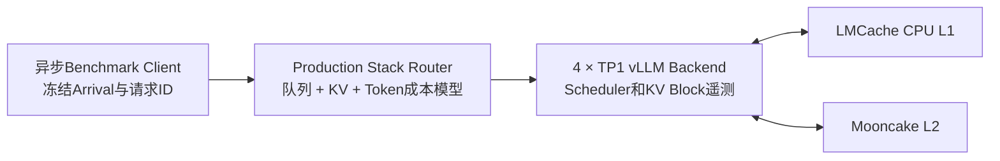

# 面向长上下文代码Agent的Workload-aware KV Cache

[English](README.md) | 中文

[](https://github.com/yangsiqt/workload-aware-kv-cache/actions/workflows/tests.yml)
[](LICENSE)

本项目研究长上下文、多轮代码Agent的推理服务优化：联合考虑KV Cache
局部性、Backend实时排队和Token工作量，而不是只追求最高Prefix Cache命中率。

实验使用Qwen3-30B-A3B-Instruct-2507、SWE-bench Verified衍生的
8K/16K/32K多轮请求和真实NVIDIA H20。它是推理系统Benchmark，不报告
SWE-bench解题率，也不会把gold patch放入模型Prompt。

## 为什么做这个项目

多轮代码Agent返回同一GPU时，可以复用巨大的仓库前缀；但严格亲和性也可能
把请求持续压到热点GPU。引入外部KV后，Router还需要判断：从CPU L1或
Mooncake L2加载，是否真的比在空闲GPU重新Prefill更快。

项目完成了两个正式优化阶段：

1. **双H20 Queue/Locality-aware Router**：在session KV局部性与Backend
   排队之间做取舍。
2. **四H20 Adaptive KV V2.3**：根据真实Prefill/Decode工作量和执行反馈，
   联合选择Backend以及Local HBM、LMCache CPU L1、Mooncake L2或Recompute。

## 系统架构



Client、Router decision/completion、Scheduler生命周期和Worker执行事件按
`request_id + attempt_id + backend_id`关联。正式Before/After开始前冻结
workload、Arrival Trace、配置和五仓Commit。

## 真实双H20结果

双卡主实验包含50个SWE-bench衍生session、每个六轮、共300请求，使用一条
固定Poisson Arrival Trace。External KV与PD关闭，只比较vLLM本地Prefix
Cache之上的路由策略。

| 策略 | TTFT p90 | E2E p90 | 吞吐 | Token命中 | Session迁移 |
|---|---:|---:|---:|---:|---:|
| 官方`prefixaware-512` | 3057.1 ms | 6960.2 ms | 1.799 req/s | 83.30% | 0.00% |
| `agent_slo_aware` | 1526.5 ms | 2182.5 ms | 1.861 req/s | 82.58% | 2.40% |
| 变化 | **-50.1%** | **-68.6%** | **+3.4%** | -0.72个百分点 | +2.40个百分点 |

在独立的16K共享前缀热点实验中，`agent_slo_aware`将TTFT p90降低25.8%、
E2E p90降低21.1%、吞吐提高27.1%。其机制是：当少量可控的局部性损失
能够消除更大的排队热点时，不让KV命中率压倒排队成本。

- [双H20主实验](reports/dual-h20/main-r1-comparison.md)
- [16K热点实验](reports/dual-h20/hotspot-16k-c16-comparison.md)

以上是真实GPU、单条固定Trace结果，不声称统计置信区间。

## 真实四H20 Adaptive KV V2.3结果

公开结果为预注册主Trace：1200请求、4×H20 96GB、四个TP1 Backend、
`max_num_seqs=12`、每Backend 8 GiB CPU L1和24 GiB Mooncake L2，
3.5/1.5 RPS交替且平均2.5 RPS，Client concurrency为64。

| 指标 | fixed-4096 | Adaptive V2.3 | 变化 |
|---|---:|---:|---:|
| TTFT p50 | 1567.3 ms | 553.6 ms | **-64.7%** |
| TTFT p90 | 9631.9 ms | 5414.1 ms | **-43.8%** |
| TTFT p95 | 12420.8 ms | 8124.3 ms | **-34.6%** |
| TTFT p99 | 18617.3 ms | 12883.5 ms | **-30.8%** |
| E2E p50 | 3501.4 ms | 1908.4 ms | **-45.5%** |
| E2E p90 | 16543.8 ms | 13190.5 ms | **-20.3%** |
| E2E p95 | 19542.8 ms | 17434.5 ms | **-10.8%** |
| E2E p99 | 27826.5 ms | 21420.7 ms | **-23.0%** |
| 请求吞吐 | 2.5014 req/s | 2.5013 req/s | -0.002% |
| SLO Goodput | 1.5008 req/s | 2.0302 req/s | **+35.3%** |
| SLO违约率 | 40.00% | 18.83% | **-21.17个百分点** |

Adaptive V2.3发生409次策略覆盖和409次KV路径变化。该Trace中的主要机制是：
避开不确定或高成本的外部恢复，转向已验证的HBM复用或Recompute；不能将
结果表述为“提高了L1/L2命中率”。

- [主Trace报告](reports/four-h20/v2.3-primary-trace.md)

结果范围为`PRIMARY_TRACE_REAL_4XH20_COHORT30_HOTSET`。公开数字只代表
一条预注册Trace，不构成跨Trace稳定性结论。

## 源码二次开发

| 组件 | 主要改动 |
|---|---|
| [Production Stack Router](https://github.com/yangsiqt/production-stack/tree/feature/workload-aware-kv-v2.3) | Queue/Locality成本模型，HBM/L1/L2/Recompute候选，请求/attempt预留，生命周期幂等回收，Decode backlog EWMA和fixed反事实成本 |
| [vLLM](https://github.com/yangsiqt/vllm/tree/feature/workload-aware-kv-v2.3) | Backend级Prefill/Decode调度与等待Token、剩余Decode工作量、KV Block压力、Prefix Cache generation和enqueue生命周期 |
| [LMCache](https://github.com/yangsiqt/LMCache/tree/feature/workload-aware-kv-v2.3) | 逐请求严格L1/L2控制、明确降级、多层Residency revision和分阶段actual path/load反馈 |
| [Mooncake](https://github.com/yangsiqt/Mooncake/tree/feature/workload-aware-kv-v2.3) | Client读取字节、failure、miss、latency以及inflight operation/bytes遥测 |

vLLM修改的是Scheduler可观测性和KV Connector集成，不声称修改CUDA Kernel
或核心调度算法。Mooncake承担外部KV传输/存储，本项目没有重新设计其传输
协议或调度器。

精确上游基线和正式Commit见
[`components.lock.yaml`](components.lock.yaml)。

## 复现实验入口

双H20 Router实验：

```bash
./scripts/run_dual_h20_router_experiment.sh
```

四H20 V2.3 readiness与正式入口：

```bash
./scripts/check_v2_3_readiness.sh
./scripts/run_four_h20_kv_v2_3.sh --run-tag <unique-utc-tag>
```

四卡正式workload为200 sessions × 六轮 = 1200请求，SHA256为
`ac078a5b169556a289243e5a11bce8d0014a309ef5c08b0d94ce66166b364714`；
公开主Arrival Trace SHA256为
`69964a26e2e9b4055f4147acf53f5c7e613fc16d8b551b2a48c6a9103d40ae26`。
原始数据、模型权重、逐请求Trace和日志不提交到Git。

## 仓库结构

```text
benchmarks/   workload生成、Client、Trace Join、分析与门禁
configs/      双H20及四H20冻结配置
scripts/      环境检查和可续跑实验编排
tests/        Router、Trace、生命周期及分析的确定性测试
reports/      可公开的小型结果摘要
data/         数据集revision、SHA和小型manifest
```

## 限制

- 公开四卡表格只覆盖一条预注册Cohort30热点Trace，不是普适线上结论。
- Controlled Prefix Cache结果只用于机制证明。
- Adaptive PD、NVLink KV传输、SGLang、Nsight Systems和CUDA Kernel优化
  不属于已完成的公开范围。
- 结果仅适用于固定的模型、硬件、workload、并发、缓存容量和Arrival Trace。

## 工件策略与许可证

仓库只跟踪项目源码、配置、测试、数据revision/SHA和小型结果摘要。模型
权重、原始公开数据、仓库快照、密钥、逐请求Trace和日志不进入Git。第三方
项目和数据仍遵循其上游许可证与使用条款。

项目自研源码使用[Apache License 2.0](LICENSE)。
