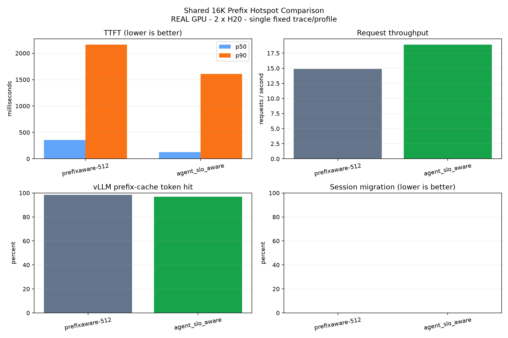

# Shared 16K Prefix Hotspot Comparison

REAL GPU - 2 x NVIDIA H20 - single fixed trace/profile - p99 excluded

| Policy | Success | TTFT p50/p90 (ms) | E2E p50/p90 (ms) | req/s | token hit | migration |
|---|---:|---:|---:|---:|---:|---:|
| prefixaware-512 | 64/64 | 358.4/2163.4 | 557.8/2628.2 | 14.896 | 98.39% | 0.00% |
| agent_slo_aware | 64/64 | 125.5/1606.2 | 424.6/2074.4 | 18.927 | 96.83% | 0.00% |

`estimated_uncached_tokens` is derived from vLLM aggregate token counters; it is not an exact per-request recomputation count.
