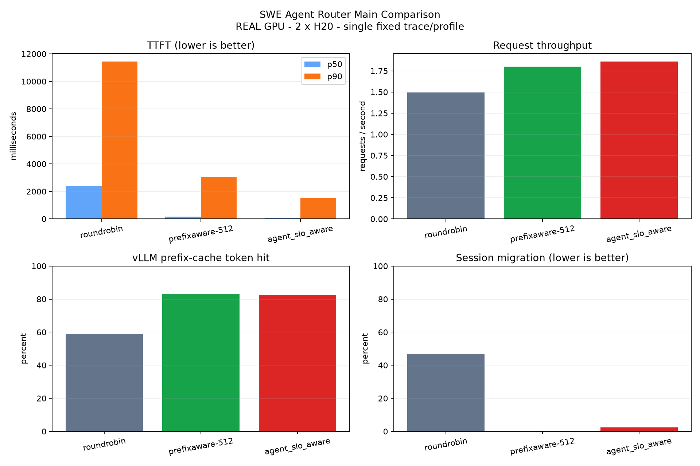

# SWE Agent Router Main Comparison

REAL GPU - 2 x NVIDIA H20 - single fixed trace/profile - p99 excluded

| Policy | Success | TTFT p50/p90 (ms) | E2E p50/p90 (ms) | req/s | token hit | migration |
|---|---:|---:|---:|---:|---:|---:|
| roundrobin | 300/300 | 2422.2/11447.9 | 5259.1/21766.4 | 1.496 | 58.93% | 46.80% |
| prefixaware-512 | 300/300 | 180.4/3057.1 | 666.6/6960.2 | 1.799 | 83.30% | 0.00% |
| agent_slo_aware | 300/300 | 97.8/1526.5 | 655.9/2182.5 | 1.861 | 82.58% | 2.40% |

`estimated_uncached_tokens` is derived from vLLM aggregate token counters; it is not an exact per-request recomputation count.
